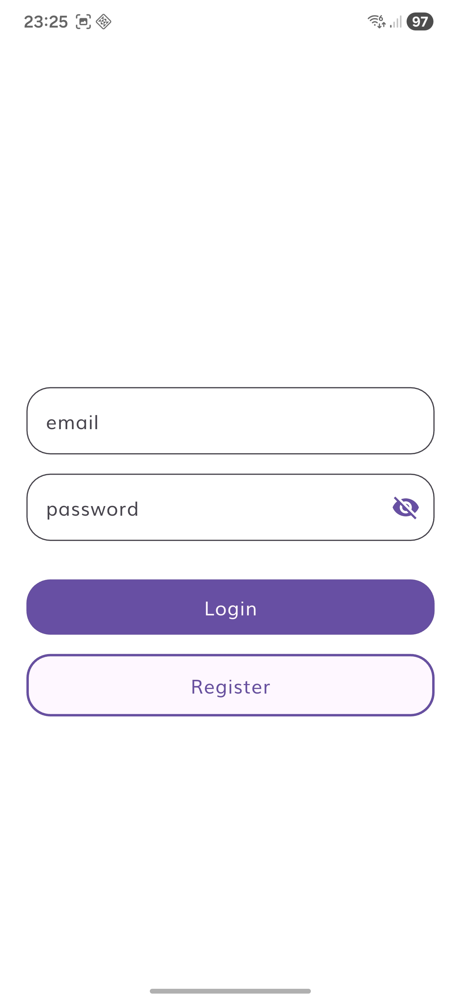
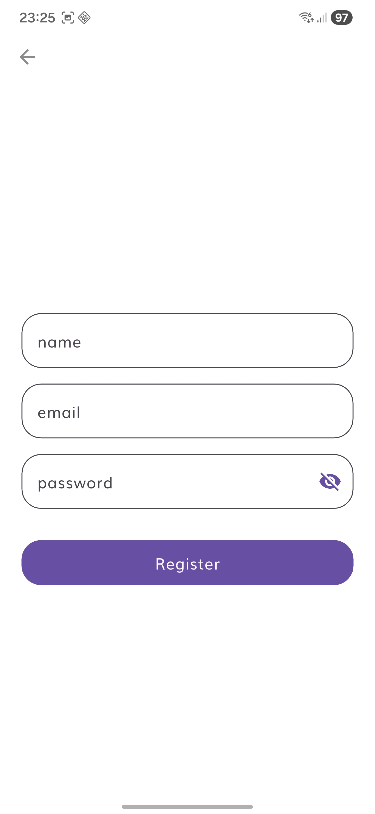
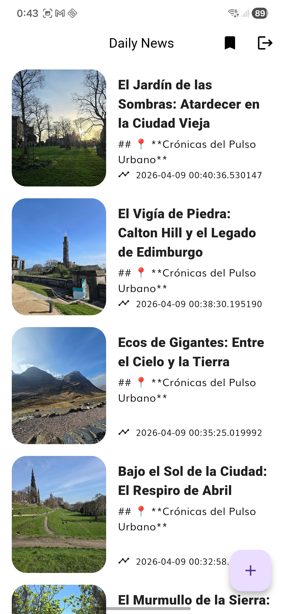
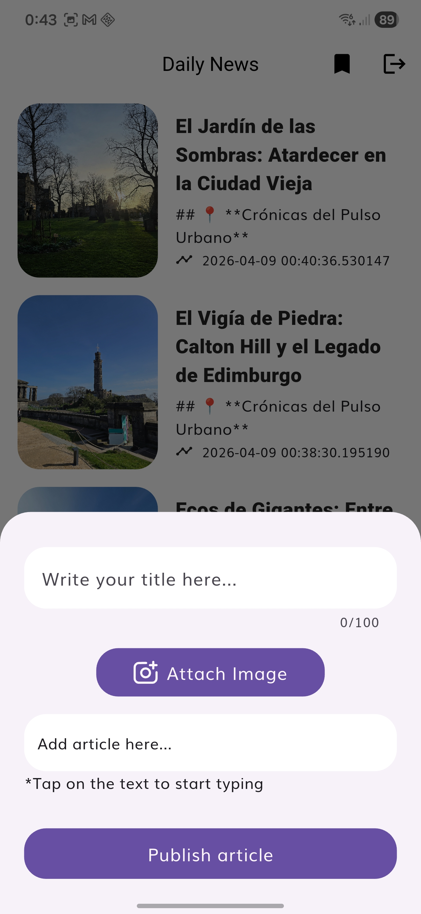
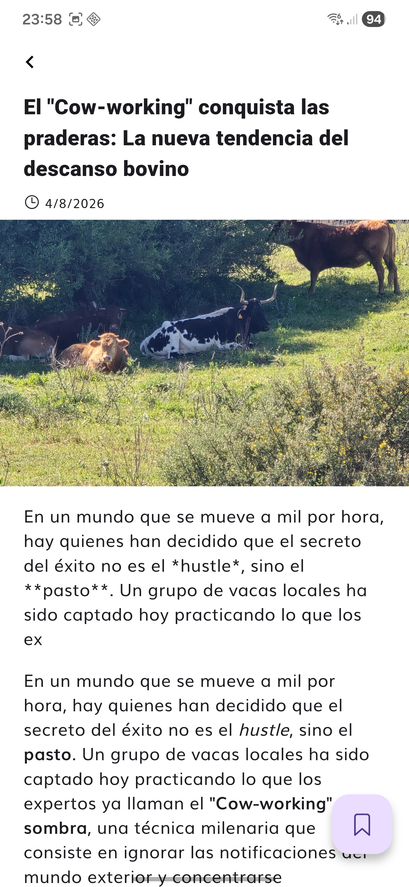

# Project Report

## 1. Introduction

At the start of this project, I had the impression it was a standard proof of concept; however, upon reading the instructions in more detail, I realized the project was more demanding than it appeared, as there are several key points to consider:

* **Authentication & Data Model:** Since the data model requires an author, implementing login functionality is necessary. Therefore, I had to include: **Login, Register, and Logout**.
* **Architecture:** The project has a clearly defined architecture. It is essential to study the documentation thoroughly to follow the established development line.
* **Platform Support:** It was only configured for Android; I had to add the configuration for **iOS**.
* **Ecosystem:** The specifications state that **Firebase** is used for the entire ecosystem, although there is an option to use other technologies.
* **Clean Architecture:** There are specific steps to follow before establishing communication with Firebase. This is directly related to the teachings in Robert C. Martin's book, *"Clean Architecture,"* where he provides an example of a development process very similar to the one proposed in this test.

## 2. Learning Journey

Since I am quite familiar with the Firebase environment, I decided to focus on learning how the project functions and identifying areas for improvement. Specifically, I focused on:

* Using the structure defined by the project.
* Analyzing potential improvements and prioritizing them based on time estimates.
* Implementing a workflow using **Merge Requests (MRs)** to track the project's evolution.

However, I noticed some discrepancies between packages. One example was **Floor**, which I replaced with a fork called **Froom** to maintain the logic within the app.
Additionally, this is the first time I have used **BLoC** instead of Cubits. Consequently, I conducted research into current best practices, such as using `sealed class` instead of `abstract class`.

## 3. Challenges Faced

The biggest challenge was dealing with this specific type of architecture. Since the entire architecture is contained within a single "feature," performing a clean separation of layers is more complex.

To address this, I unified the logic for some screens and utilized `setState` where appropriate to avoid overloading the BLoC with unnecessary states.
Furthermore, updating the legacy project was a significant hurdle. I had to update **Gradle**, dependencies, and packages. As this was time-consuming, I opted to use **AI agents** to optimize the process.

## 4. Reflection and Future Directions

Developing this project has allowed me to gain a higher level of abstraction regarding state management and its importance within an architecture. This choice defines the project's direction and the ability to pivot easily—as seen with the switch to **Froom**. It was also my first time using AI agents to assist with dependency management.

### Key Takeaways

* **Design Patterns:** Using established patterns significantly reduces development costs.
* **AI Integration:** AI agents greatly speed up development, provided they are properly supervised.
* **Documentation:** Good documentation allows developers to adapt to a project quickly.
* **Analysis:** Dedicating time to analysis allows for fixed objectives and the ability to pivot if estimates change.

### Proposed Improvements

Analyzing the project structure, I detected that it is not possible to modularize functionality unless it belongs to a specific feature. This means we would modularize *data, domain,* and *presentation* as a single feature tightly coupled to the project.

To improve this, I propose a division into two distinct packages:

1. **Data Package:** This would mirror the current "data" folder structure and communicate directly with the Domain package, divided by feature. It would include a `core` folder for internal package utilities.
2. **Domain Package:** This would mirror the current "domain" folder and communicate with the Data package via **Repository interfaces**, also divided by feature.

**What about the Presentation layer?** This layer would remain within the main project and communicate directly with Domain to access data models and use cases. This allows for:

* **Reusability:** A `ProfileBloc` could access an `UpdateUser` use case without needing to communicate with a `UserBloc`.
* **Encapsulation:** Packages allow us to select exactly which files are exported/visible.
* **Versioning:** Each layer can be versioned separately in different repositories, allowing for safer rollbacks.

## 5. Proof of the Project

This project is configured for Android, the screenshots provided are from an Android device.

### Demo

### Login

### Register

### Daily news

### Saved articles

### Publish article

### Article details

## 6. Overdelivery

I took the liberty of implementing several additional improvements:

### Markdown Editor

Introduced a Markdown editor by creating a `base_markdown_text_field.dart` class that follows the app's unified styling.

### Publish Articles via Dialog

To improve app flow, I implemented a `bottomDialog` for publishing articles. The article list updates automatically upon posting.

### Lazy Loading Articles

The remote article list uses pagination, fetching more content as the user reaches the end of the list.

### Firebase Auth & Registration

To provide authors for the app, I integrated:

* Logic for adding users via `firebase_auth`.
* Logic for storing user data in the database.
* Custom exception handling.
* **Future improvements:** Add Google/Apple sign-in, profile picture uploads, and user deletion logic.

### Generic Error Handling

Added an abstraction layer for `DioException`, `FirebaseAuthException`, `FirebaseException`, and `DatabaseException` into a generic class, replacing Data dependencies with `DataState`.

### GoRouter Implementation

Added the `go_router` package for simpler, more robust navigation.

* **Future improvement:** Implement best practices defined by VeryGoodVentures.

### Localization (i18n)

The app is now internationalized to support different languages/dates based on device settings. Currently, English is supported.

* **Future improvement:** Add Spanish and a manual language selector stored in the DB.

### Feedback System

Added **Snackbars** to provide immediate feedback when publishing or saving articles, informing if the operation was successful.
